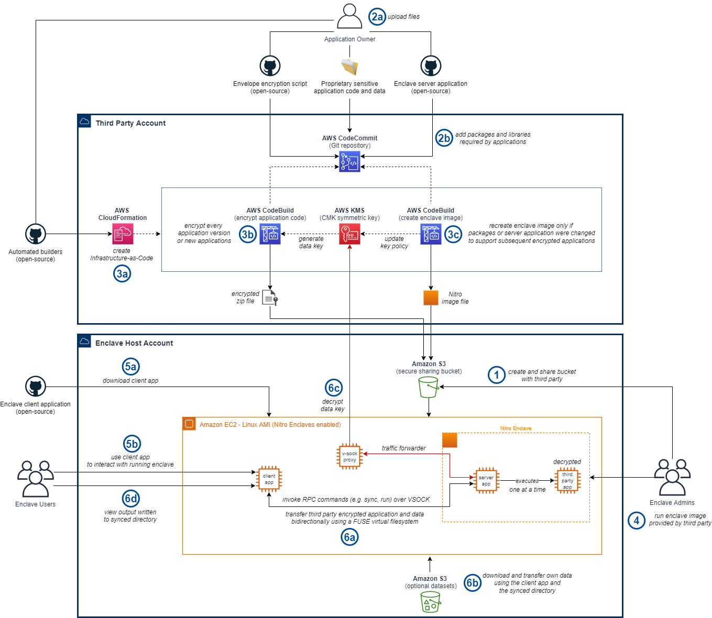

# AWS Graviton - Run Confidential ML Workloads

> This is an example solution using AWS Nitro Enclaves

## Prerequisites

To use the material in this sample, we recommend
 intermediate-advanced knowledge for:
- Amazon EC2 and containers
- Linux shell commands
- Cloud infrastructure concepts

Basic knowledge of how to run ML inference and
 [AWS Graviton](https://aws.amazon.com/ec2/graviton/)
 processors (Arm64 servers) is also useful.

## Introduction

Customers from diverse industries collaborate with other parties to exchange
 sensitive information, such as code and data. For artificial intelligence
 (AI), machine learning (ML), and data science (DS) practitioners, the ability
 to experiment with externally-provided algorithms, models, and datasets is
 key to improving business outcomes.

We will demonstrate how you can share your sensitive AI/ML files
 in a manner that safeguards application and data confidentiality.
 To present you with a familiar environment, we included the ability
 to do seamless data transfers to accelerate ML and DS workloads,
 as well as run software downloaded at runtime to process that
 data conveniently.
 
[AWS Nitro Enclaves](https://aws.amazon.com/ec2/nitro/nitro-enclaves/)
 enables customers to create isolated compute environments to maintain
 confidentiality of applications and data. The sample provided uses
 Nitro enclaves to enable sensitive file sharing and usage
 for ML workloads.

## Use cases

The implementation provided in this sample enables the following use cases:
-	a third-party provides an application, optionally with ML files
 (e.g. models) and/or datasets, and the customer runs it in the enclave
-	a third-party provides an application, optionally with ML files,
 and the customer runs it in the enclave with their own datasets
-	a third-party provides an application and the customer runs it
 in the enclave with their own ML files and/or datasets

While the solution we provide is currently configured to run just Python
 applications, the server code packaged with the enclave can be adjusted
  with minimal changes to support other types of applications too.

## Usage

The following Linux shell commands demonstrate the flexibility an application
 user has when operating applications and data transfers from the EC2 instance.

To enable data transfers to the Nitro Enclave, sync a local directory
 to the enclave’s in-memory filesystem:

```shell
python3 client.py sync -d synced_folder
```

To copy confidential application packages (which can include ML models and datasets)
 to the enclave:
```shell
cp application.encrypted synced_folder/encrypted
```

To copy optional plaintext datasets or ML models owned by the user to the enclave:
```shell
cp -r dataset/* synced_folder/dataset/
cp -r model/* synced_folder/model/
```

To run an example confidential application which uses an encrypted model
 (part of the encrypted application package supplied by owner) with a
 plaintext data set (owned by user):
```shell
python3 client.py run -f application.encrypted -s ml_algorithm.py -a "-m model.h5 -d /dataset/ -o /output/"
```

These commands are similar to how you would run an application locally on
 an EC2 instance, but in this case we leverage a client application which
 instructs the enclave to run the ML script in a confidential manner in
 which the user can only see the results without seeing the code being run.

## Documentation

### Architecture



The high-level workflow is the following:
1.	An application user creates and shares an Amazon S3 bucket with the application owner (third-party) in which they can store encrypted applications and enclave image files.
2.	An application owner uploads their sensitive plaintext files, along with utilities supplied with this solution, into their private AWS CodeCommit Git repository.
3.	An application owner deploys AWS CodeBuild projects for automated encryption and enclave image builds using Infrastructure-as-Code supplied with this solution. The output files are automatically shared with the application user via the shared S3 bucket. The application owner’s account owns the KMS key used to encrypt applications. Access to decrypt data using this key is controlled using its resource policy. The enclave image build process keeps the policy condition up-to-date with the PCR0 hash of the latest built enclave image file.
4.	An IT administrator allocates compute, and memory resources for the EC2 instance that will host the enclave and grants the required AWS IAM permissions.
5.	An application user downloads the client application supplied with this solution, so they can interact with the running enclave.
6.	An application user can download externally-provided sensitive files, as well as their own data, and transfer them to the enclave for usage. Applications are only decrypted within the boundary of the running enclave, which the user does not have access to. The output files returned by the applications will be stored in a shared directory between the enclave and the parent EC2 instance, from where the user can process them without restrictions.

On one hand, the design of the solution puts the application owner in control of who can use their application code, when, and how. On the other hand, the application user is in control of which files they run and which external services a running enclave can access.

### Operational

The user guide to create and operate the enclave is available in the
 [RUNBOOK](./RUNBOOK.md) with step by step instructions that follow
  the flow described in the architecture diagram.

### Technical

- [Client Application - EC2 Instance](./doc/Client.md)
  - Covers the [client application Python code](./src/client)
- [Server Application - Nitro Enclave](./doc/Server.md)
  - Covers the [server application Python code](./src/server)
- [Encryption](./doc/Encryption.md)
  - Covers the
  [encryptor application Python code](./src/encryption/envelope_encryptor.py)
  - Covers the
  [automated application encryptor CloudFormation template](./src/encryption/Deploy-ApplicationEncryptor-Cfn.yaml)
  - Covers usage of [AWS IAM](https://aws.amazon.com/iam/)
  and [AWS KMS](https://aws.amazon.com/kms/) to define controlled policies
- [Builder](./doc/Builder.md)
  - Covers the
  [automated enclave image builder CloudFormation template](./src/builder/Deploy-NitroImageBuilder-Cfn.yaml)

## Constraints

- Only one third-party application can be run on an enclave at a given time
- The third-party will use only one KMS CMK key to generate data keys to encrypt
 their applications and data

- The AWS region **eu-west-1 (Ireland)** is hardcoded in this sample in multiple
 files (including documentation). If you need to change to another untested
 region, modify the following code files:
  - src/encryption/envelope_encryptor.py (REGION)
  - src/server/containers/enclave_app/server/process/run.py (REGION)
  - src/server/containers/enclave_base/Dockerfile (KMS endpoint)
  - src/client/network/proxy-config-kms.yaml (KMS endpoint)
  - src/client/client.py (KMS endpoint)

## [Code of Conduct](CODE_OF_CONDUCT.md)

This project has adopted a [Code of Conduct](./CODE_OF_CONDUCT.md)
 that we expect project participants to adhere to.

## [Contributing Guide](CONTRIBUTING.md)

Read our [contributing guide](./CONTRIBUTING.md) to learn about our development process,
 how to propose bug fixes and improvements, and how to
 integrate your changes in this repository.

## License

This project is licensed under a modified [MIT-0 License](./LICENSE).
