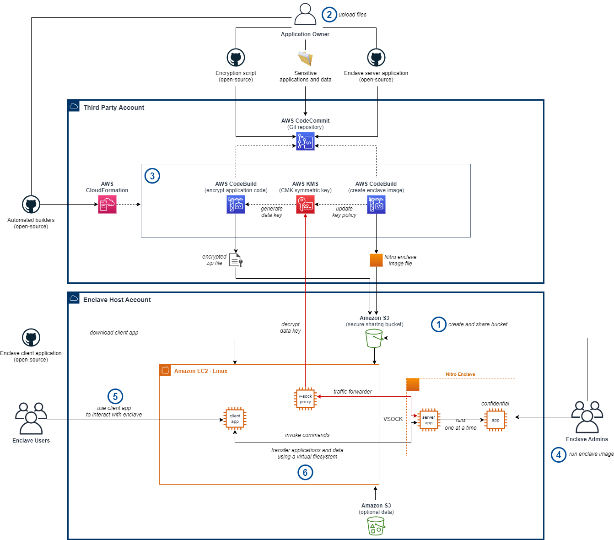

# Run Confidential ML Workloads using AWS Nitro Enclaves

## Introduction

Third-parties own many types of sensitive information
 such as: code, algorithms, machine learning models, or datasets.
 For collaboration in industries such as research, the third-party
 will only share their data with customers if they have a guarantee
  the files are not visible in plaintext form.

[AWS Nitro Enclaves](https://aws.amazon.com/ec2/nitro/nitro-enclaves/)
 enables customers to create isolated compute environments to maintain
 confidentiality of applications and data. The sample provided uses
 Nitro enclaves to enable sensitive file sharing and usage
  for ML workloads.

## Use cases

The implementation provided in this sample enables the following use cases:
-	a third-party provides an application, optionally with ML files
 (e.g. models) and/or datasets, and the customer runs it in the enclave
-	a third-party provides an application, optionally with ML files,
 and the customer runs it in the enclave with their own datasets
-	a third-party provides an application and the customer runs it
 in the enclave with their own ML files and/or datasets

While the solution we provide is currently configured to run just Python
 applications, the server code packaged with the enclave can be adjusted
  with minimal changes to support other types of applications too.

## Documentation

### Architecture

### Operational

The user guide to create and operate the enclave is available in the
 [RUNBOOK](./RUNBOOK.md) with step by step instructions that follow
  the flow described in the architecture diagram.

### Technical

- [Client Application - EC2 Instance](./doc/Client.md)
  - Covers the [client application Python code](./src/client)
- [Server Application - Nitro Enclave](./doc/Server.md)
  - Covers the [server application Python code](./src/server)
- [Encryption](./doc/Encryption.md)
  - Covers the
  [encryptor application Python code](./src/encryption/envelope_encryptor.py)
  - Covers the
  [automated application encryptor CloudFormation template](./src/encryption/Deploy-ApplicationEncryptor-Cfn.yaml)
  - Covers usage of [AWS IAM](https://aws.amazon.com/iam/)
  and [AWS KMS](https://aws.amazon.com/kms/) to define controlled policies
- [Builder](./doc/Builder.md)
  - Covers the
  [automated enclave image builder CloudFormation template](./src/builder/Deploy-NitroImageBuilder-Cfn.yaml)

## Constraints

- Only one third-party application can be run on an enclave at a given time
- The third-party will use only one KMS CMK key to generate data keys to encrypt
 their applications and data

- The AWS region **eu-west-2 (London)** is hardcoded in this sample in multiple
 files (including documentation). If you need to change to another untested
 region, modify the following code files:
  - src/encryption/envelope_encryptor.py (REGION)
  - src/server/containers/enclave_app/server/process/run.py (REGION)
  - src/server/containers/enclave_base/Dockerfile (KMS endpoint)
  - src/client/network/proxy-config-kms.yaml (KMS endpoint)
  - src/client/client.py (KMS endpoint)

## [Code of Conduct](CODE_OF_CONDUCT.md)

This project has adopted a [Code of Conduct](./CODE_OF_CONDUCT.md)
 that we expect project participants to adhere to.

## [Contributing Guide](CONTRIBUTING.md)

Read our [contributing guide](./CONTRIBUTING.md) to learn about our development process,
 how to propose bug fixes and improvements, and how to
 integrate your changes in this repository.

## License

This project is licensed under a modified [MIT-0 License](./LICENSE).
